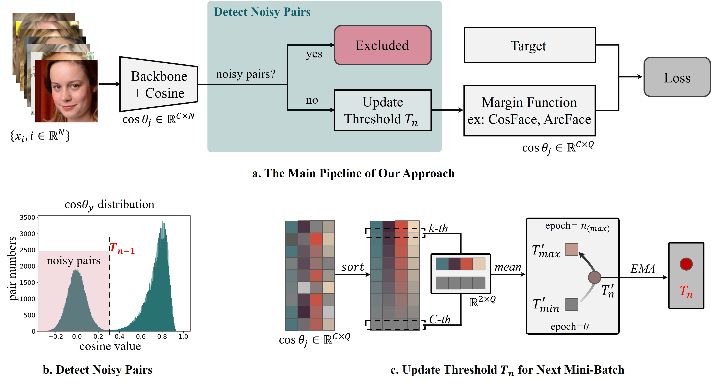

# DDLN: Detecting and Discarding Label Noise for Noise-Robust Face Recognition

## Abstract

Label noise is a major challenge in large-scale supervised face recognition, where weak or automatic annotations often introduce errors that mislead training. To address this, we propose a noise robust framework that performs noise detection and sample selection directly in cosine-similarity space. We observe that the non-target cosine similarities of clean samples share a highly consistent distribution profile with the target similarities of unfitted mislabeled samples. This phenomenon can be explained from a backpropagation perspective and provides a cue for monitoring label noise during training. Based on this observation, we formulate noise detection as boundary estimation in similarity space. Specifically, we track the upper bound of high-confidence clean non-target similarities to determine the filtering threshold, without requiring prior knowledge of the noise rate or auxiliary networks. We further introduce a progressive rule during early training, where the threshold gradually increases from the estimated noise lower bound to the upper bound. This process discards unreliable pairs while retaining hard but clean samples. Extensive experiments on eight synthetic and three real-world noisy datasets demonstrate that our method achieves superior noise detection and state-of-the-art recognition accuracy, with only about 0.2\% additional measured overhead in the ResNet50-CosFace setting. The filtered dataset produced by our method is also beneficial for subsequent training.
## Framework

<p align="center">
  
</p>

## Usage Rules

The proposed noise filtering module is designed for margin-based face recognition training, such as CosFace and ArcFace.

### 1. Input format

The module receives cosine similarities and identity labels:

```python
cosine: Tensor of shape [B, C]
label: Tensor of shape [B]
current_epoch: int
```

where `B` is the batch size and `C` is the number of identities/classes.

### 2. Basic usage

```python
from noise_filter_DDLN import NoiseFilter

noise_filter = NoiseFilter(
    log=None,
    milestone0=11,
    gap_epoch=2,
    top_class=10,
    ema_t=0.01,
    alpha=0.02
)

cosine_new, label_new = noise_filter(
    cosine,
    label,
    current_epoch
)
```

The filtered `cosine_new` and `label_new` are then used to compute the margin-based classification loss.

### 3. Usage with CosFace

```python
from noise_filter_DDLN import build_head

head = build_head(
    head_type="cosface_denoise",
    m=0.35,
    s=64.0
)

logits, labels = head(
    cosine,
    label,
    current_epoch
)
```

### 4. Parameter setting

```text
milestone0: first learning rate decay epoch
gap_epoch: number of epochs reserved before milestone0 for progressive threshold updating
top_class: number of high non-target similarities used for boundary estimation
ema_t: EMA coefficient for threshold smoothing
alpha: slack term for upper-bound estimation
```

Filtering is disabled at epoch 0 to stabilize early training.

## Dataset

Dataset resources are available at [Baidu Netdisk](https://pan.baidu.com/s/1OjSuDxIxlOIFFj6j6axHEQ?pwd=ni3v), with extraction code `ni3v`.

The package includes simulated noisy dataset lists based on CASIA-Clean and the real-world noisy dataset WebFace2M-Noise. These resources are provided for academic research only.

